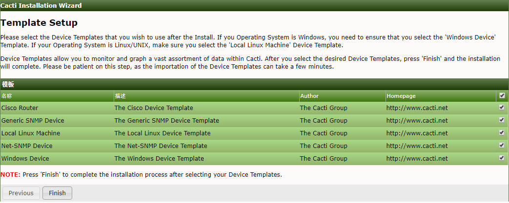
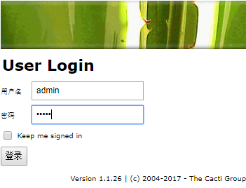

## 问题
原来在安装配置cacti的时候一直感叹安装步骤繁琐无比，光是环境依赖就要安装很多个，而且配置文件也要改很多东西，万一哪一步错了纠正也很麻烦，很容易就又从头开始，十分恶心。但是程序装不好，看不到跑出来的效果，谈什么二次开发，所以装好软件算是一个必要条件，但注意力不应该放在这里。

以前了解到docker之后一直想自己搭建一个cacti的开发平台，给团队成员节约点时间，这几天终于实现了。最后的效果就是安装好docker之后把代码pull下来执行一条命令就可以运行了。

## [Docker]简介
### 目的
官网这么写：Increase security, enable portability and lower costs in 5 days without changing app code.
增加安全性，启用可移植性，并在5天内降低成本，而不更改应用程序代码。

通俗来讲，同样一段代码，在win、linux和mac上可能跑出不一样的结果/效果，即使你都配置了所需的环境，在同样的一个系统平台上也可能由于环境版本的不一致导致不完全一样的效果，而docker解决了这个问题。它使得应用在不同的平台上所部署的环境完全一致。而且和虚拟机相比，docker的容器更轻量，部署更方便，性能更好。

### 镜像（image） 容器（container） 仓库（registry）

要使用docker最好先理解这三个基本的概念。镜像提供了运行容器时所需的一切文件，特点是分层存储，可以类比操作系统镜像。而容器是镜像运行时的实体，可以被创建、启动、停止、删除、暂停。镜像和容器就类似于面向对象中`类`与`对象`的关系，镜像是静态的，而容器是动态的。Registry就是用来存放镜像的地方，类似于github的repository。

推荐一个Docker基础教程[Docker practice]

## 解决方法
因为安装cacti需要很多软件的支撑：apache、mysql、php、snmp，还有很多php的模块（ldap、mysql、snmp、gd、pdo、session、mbstring、json等等等等），安装完还要配置。所以就把这些全部在构建镜像时做好（写Dockerfile构建镜像），运行时只需要安装cacti就好了，因为考虑到以后开发的需要，把cacti的源码放在容器外，使用volume将其挂载到运行的容器上。

数据库单独使用一个容器，另一个容器运行cacti，这时需要两个容器一起工作，这里使用docker-compoe.yml来进行组织。

## 使用步骤

### 安装Docker

在[Docker]官网下载安装即可，win10最好安装[Docker for Windows](https://download.docker.com/win/stable/Docker%20for%20Windows%20Installer.exe)（使用hyper-V，性能更佳）而不是Docker Toolbox。 

### 下载所需文件
有两个，一个是cacti的源码（用于安装及以后的二次开发），一个是运行docker所需的（主要是docker-compose.yml）

如果已经安装了git的话，新建一个空文件夹，在命令行下进入该文件夹，执行下面两条命令：
```
git pull https://github.com/hunterMG/cacti.git
git pull https://github.com/hunterMG/cacti-docker.git
```
如果没有git，到[这里](https://github.com/hunterMG/cacti)和[这里](https://github.com/hunterMG/cacti-docker)下载zip包解压到一个文件夹下即可

现在你的目录结构是这样的（如果是下载的，把目录名后面的master去掉）：
```
--work
   |--cacti
   |--cacti-docker
```
### 运行
win下需要先启动docker服务，双击桌面的docker快捷方式即可，成功启动后可以在任务栏看到一个图标（鼠标放上去可以看到`docker is running`），右键打开docker设置，把放那两个文件的盘设置为Shared Drives（volume挂载所需）。如果提示防火墙不允许，需要打开445端口，详细看[这里](https://docs.docker.com/docker-for-windows/#shared-drives)

在命令行下进入cacti文件夹，执行
```
docker-compose up
```
就可以看到两个容器正在启动，在控制台交替打印出日志。第一次启动的时间较长(需要安装cacti的模板)，大约几分钟。

看到输出`[Note] Starting httpd service.`时即可在浏览器中打开`http://localhost`，直接开始cacti的安装。

注意在这一步时


选中所有的模板；

最后点`Finish`后等大概两分钟，就可看到登录页了,默认用户名和密码都是`admin`：



第一次登录会强制修改密码，进入后开始下一步的探索吧。

## 最后
开发应该把注意力放在写代码上，而不是安装软件，感谢docker。

[Docker]: https://www.docker.com/
[Docker practice]: https://yeasy.gitbooks.io/docker_practice/